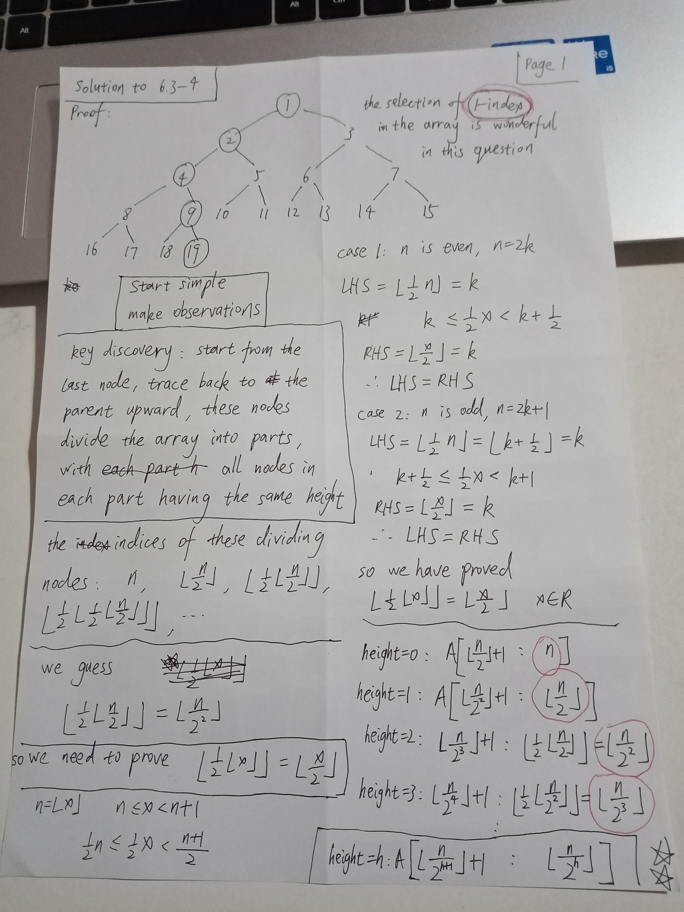
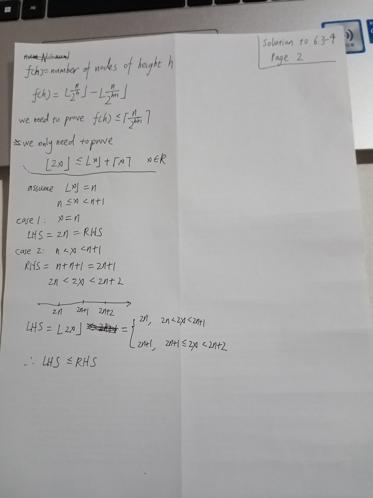

## 6.3-1

> Using figure 6.3 as a model, illustrate the operation of $\text{BUILD-MAX-HEAP}$ on the array $A = \langle 5, 3, 17, 10, 84, 19, 6, 22, 9 \rangle$.

$$
\begin{aligned}
\langle  5,  3, 17, 10, 84, 19, 6, 22, 9 \rangle \\\\
\langle  5,  3, 17, 22, 84, 19, 6, 10, 9 \rangle \\\\
\langle  5,  3, 19, 22, 84, 17, 6, 10, 9 \rangle \\\\
\langle  5, 84, 19, 22,  3, 17, 6, 10, 9 \rangle \\\\
\langle 84,  5, 19, 22,  3, 17, 6, 10, 9 \rangle \\\\
\langle 84, 22, 19,  5,  3, 17, 6, 10, 9 \rangle \\\\
\langle 84, 22, 19, 10,  3, 17, 6,  5, 9 \rangle \\\\
\end{aligned}
$$

## 6.3-3

> Why do we want the loop index $i$ in line 2 of $\text{BUILD-MAX-HEAP}$ to decrease from $\lfloor A.length / 2 \rfloor$ to $1$ rather than increase from $1$ to $\lfloor A.length/2 \rfloor$?

Otherwise we won't be allowed to call $\text{MAX-HEAPIFY}$, since it will fail the condition of having the subtrees be max-heaps. That is, if we start with $1$, there is no guarantee that $A[2]$ and $A[3]$ are roots of max-heaps.

## 6.3-4

### This exercise just helps us get a deeper understanding of the structure of the heap(complete binary tree).

