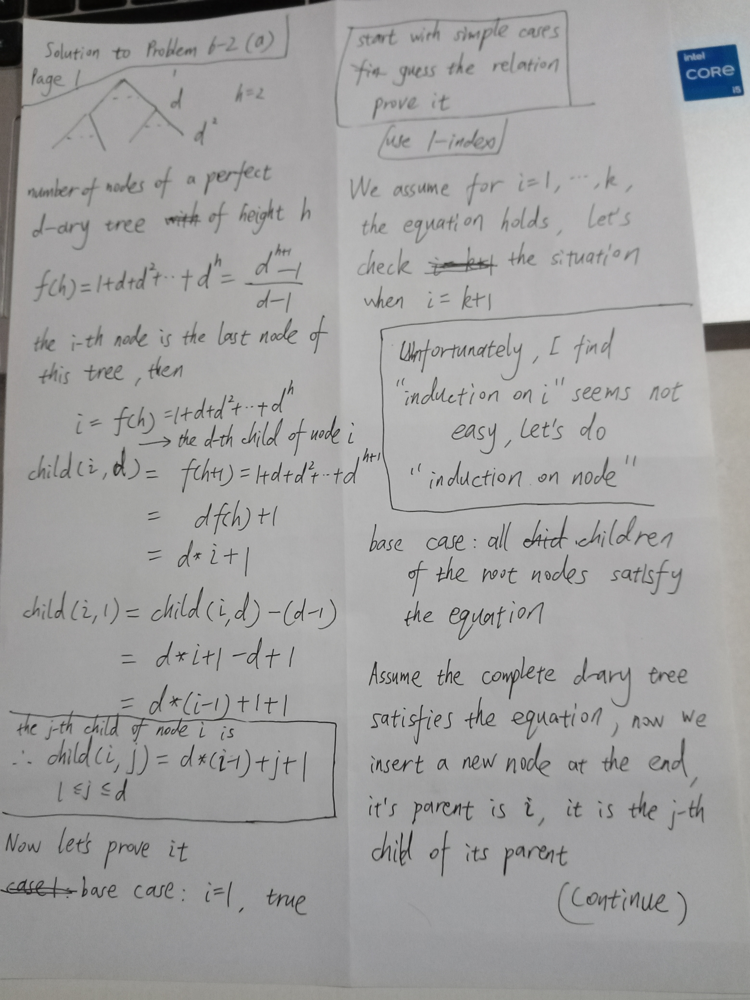
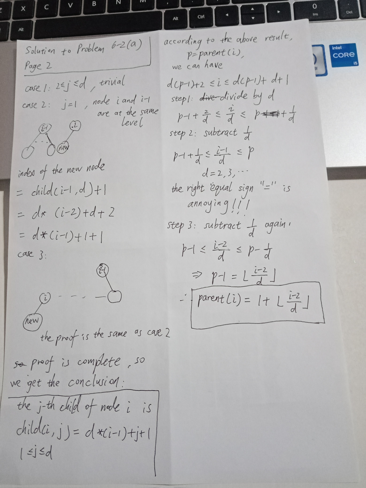

> A **_$d$-ary heap_** is like a binary heap, but (with one possible exception) non-leaf nodes have $d$ children instead of $2$ children.
>
> **a.** How would you represent a $d$-ary heap in an array?
>
> **b.** What is the height of a $d$-ary heap of $n$ elements in terms of $n$ and $d$?
>
> **c.** Give an efficient implementation of $\text{EXTRACT-MAX}$ in a $d$-ary max-heap. Analyze its running time in terms of $d$ and $n$.
>
> **d.** Give an efficient implementation of $\text{INSERT}$ in a $d$-ary max-heap. Analyze its running time in terms of $d$ and $n$.
>
> **e.** Give an efficient implementation of $\text{INCREASE-KEY}(A, i, k)$, which flags an error if $k < A[i]$, but otherwise sets $A[i] = k$ and then updates the $d$-ary max-heap structure appropriately. Analyze its running time in terms of $d$ and $n$.

**a.** We can use those two following functions to retrieve parent of $i$-th element and $j$-th child of $i$-th element.

```cpp
d-ARY-PARENT(i)
    return floor((i - 2) / d + 1)
```

```cpp
d-ARY-CHILD(i, j)
    return d(i − 1) + j + 1
```

Obviously $1 \le j \le d$. You can verify those functions checking that

$$d\text{-ARY-PARENT}(d\text{-ARY-CHILD}(i, j)) = i.$$

Also easy to see is that binary heap is special type of $d$-ary heap where $d = 2$, if you substitute $d$ with $2$, then you will see that they match functions $\text{PARENT}$, $\text{LEFT}$ and $\text{RIGHT}$ mentioned in book.


detailed proof: 




**b.** Since each node has $d$ children, the height of a $d$-ary heap with $n$ nodes is $\Theta(\log_d n)$.

**c.** $d\text{-ARY-HEAP-EXTRACT-MAX}(A)$ consists of constant time operations, followed by a call to $d\text{-ARY-MAX-HEAPIFY}(A, i)$.

The number of times this recursively calls itself is bounded by the height of the $d$-ary heap, so the running time is $O(d\log_d n)$.

```cpp
d-ARY-HEAP-EXTRACT-MAX(A)
    if A.heap-size < 1
        error "heap under flow"
    max = A[1]
    A[1] = A[A.heap-size]
    A.heap-size = A.heap-size - 1
    d-ARY-MAX-HEAPIFY(A, 1)
    return max
```

```cpp
d-ARY-MAX-HEAPIFY(A, i)
    largest = i
    for k = 1 to d
        if d-ARY-CHILD(i, k) ≤ A.heap-size and A[d-ARY-CHILD(i, k)] > A[largest]
            largest = d-ARY-CHILD(i, k)
    if largest != i
        exchange A[i] with A[largest]
        d-ARY-MAX-HEAPIFY(A, largest)

```

**d.** The runtime is $O(\log_d n)$ since the **while** loop runs at most as many times as the height of the $d$-ary array.

```cpp
d-ARY-INCREASE-KEY(A, i, key)
    if key < A[i]
        error "new key is smaller than current key"
    A[i] = key
    while i > 1 and A[d-ARY-PARENT(i)] < A[i]
        exchange A[i] with A[d-ARY-PARENT(i)]
        i = d-ARY-PARENT(i)
```


**e.** The runtime is $O(\log_d n)$ since the **while** loop runs at most as many times as the height of the $d$-ary array.

```cpp
d-ARY-MAX-HEAP-INSERT(A, key)
    A.heap-size = A.heap-size + 1
    A[A.heap-size] = key
    i = A.heap-size
    while i > 1 and A[d-ARY-PARENT(i)] < A[i]
        exchange A[i] with A[d-ARY-PARENT(i)]
        i = d-ARY-PARENT(i)